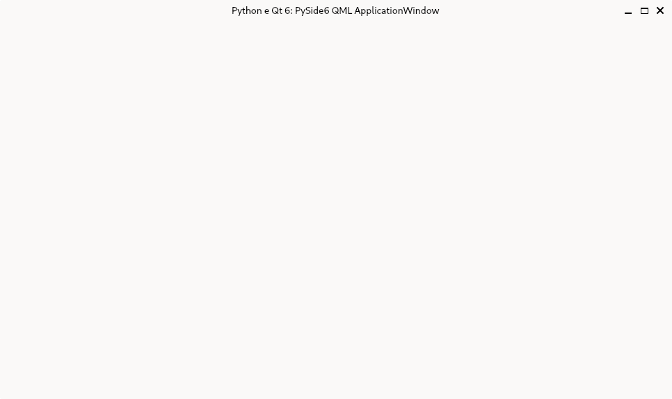
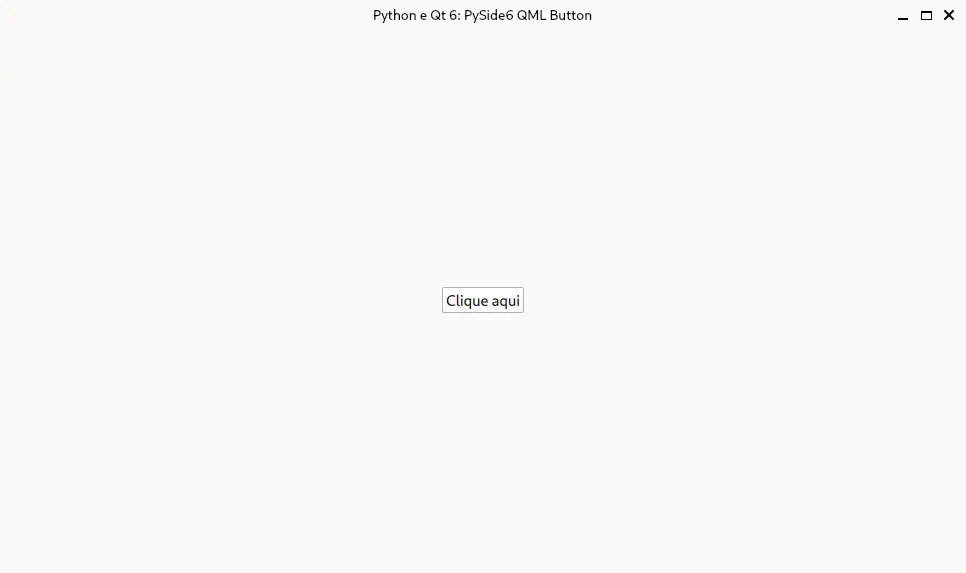

:og:author: Renato Cruz (natorsc)
:og:title: PySide6 widgets
:og:description: Exemplos de código dos widgets da biblioteca PySide6.

.. meta::
   :author: Renato Cruz (natorsc)
   :description: Exemplos de código dos widgets da biblioteca PySide6.
   :keywords: Python, Python 3, PySide6, Qt, Qt 6, QML,

=======
Widgets
=======

ApplicationWindow
=================

  
  PySide6 QML ApplicationWindow

.. tab:: Python

   ..  literalinclude:: ../../src/applicationwindow/MainWindow.py

.. tab:: QML

   ..  literalinclude:: ../../src/applicationwindow/MainWindow.qml

--------------

Button
======

  
  PySide6 QML Button

.. tab:: Python

   ..  literalinclude:: ../../src/button/MainWindow.py

.. tab:: QML

   ..  literalinclude:: ../../src/button/MainWindow.qml
